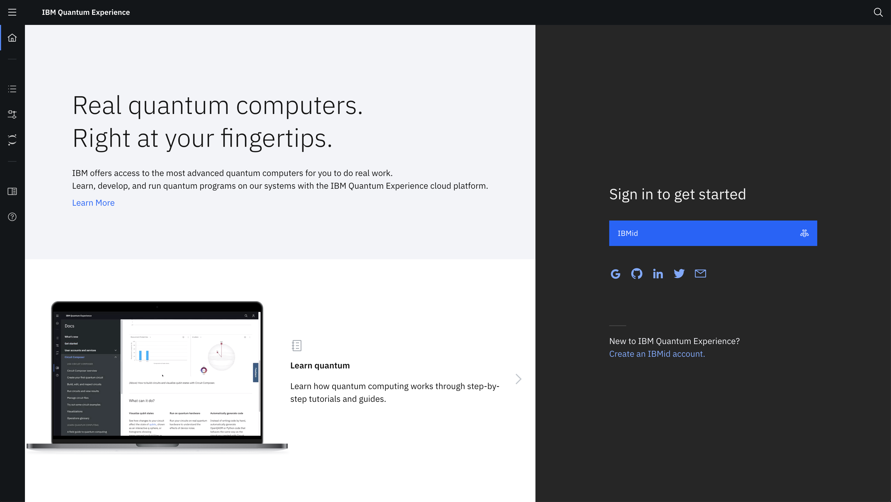
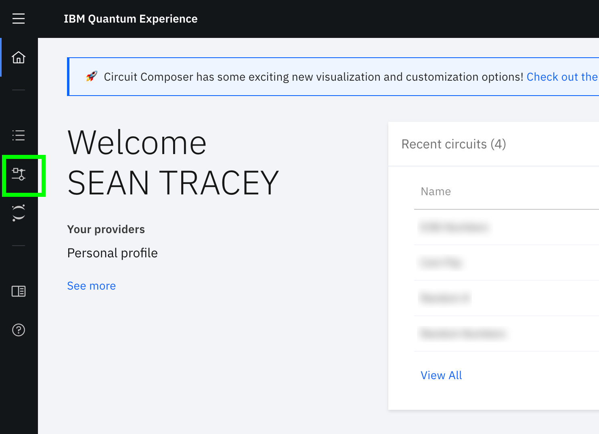

# Hands-on-with-Quantum-Computing
We live in the future 🤯

## About this workshop

This workshop is intended as a "Hello, world" for programming quantum computers.

On completion of this workshop you will have learned:

1. The basics of manipulating a Qubit in a quantum system
2. What a Hadamart gate is 
3. How to construct a quantum circuit using the [IBM Q Experience](https://quantum-computing.ibm.com/).
4. How to implement that same quantum circuit with [Qiskit](https://qiskit.org/)

With the above knowledge, we will learn how to:

1. Simulate a coin flip with a quantum computer
2. Simulate the roll of a dice with a quantum computer
3. Generate a random 8 bit number with an IBM Q

If you are a developer with little to no experience of quantum computing you will finish this workshop with a practical demonstration of the ease of which a quantum computer can be utilised through a cloud environment

If you're a quantum physicist, you will have learned the same, but you will also have been equipped with tools which you can use to run quantum experiments on an actual quantum system.

## You will need:

1. Your favourite IDE
2. An IBM account to sign in to the IBM Q Experience dashboard
    - You can also sign in with the following accounts:
        - Twitter Account
        - Google Account
        - LinkedIn Account
        - GitHub Account
3. A modern web browser
4. (Optionally) An [IBM Cloud account](https://ibm.biz/Bdq8Ly)

## Getting started

For the first part of this workshop, we're going to use the [IBM Q Experience](https://quantum-computing.ibm.com/) dashboard to create our quantum circuits.

The IBM Q Experience dashboard is a visual tool which allows us to create and execute a quantum circuit by arranging gates and connections for a number of Qubits in a quantum system.

First up, head to [https://quantum-computing.ibm.com/](https://quantum-computing.ibm.com/) and login with an account of your choice.

_A screenshot of the IBM Q Experience login page_

Once you've logged in, you'll be taken to your dashboard. On the left hand side of the screen, you should see a small toolbar of icons. Click the "Circuit Composer" icon (highlighted in green in the image below)

_A screenshot of the IBM Q Experience login page_

## Flipping a coin.

Once the page has loaded, you should now see the Circuit Composer page. Here, we can drag [quantum gates](https://en.wikipedia.org/wiki/Quantum_logic_gate) onto our quantum circuit to manipulate and measure the state of our qubit.

A "gate" is what we call an operation that can be performed on a qubit. They can be used to put a qubit in to a state of superposition, flip its state, rotate its position around an axis, adjust it's phase and more.

The combination of these gates can be used to create operations that are analogous with operations in classical computing. For example, the application of a X gate to qubit will flip its state between "0" ( `|0>` ) and "1" ( `|1>` ). This operation is equivalent to a "not" gate in classical computing.

The gate we're going to be focussing on exclusively in this workshop is perhaps the most commonly used gate - [The Hadamard Gate](https://en.wikipedia.org/wiki/Quantum_logic_gate#Hadamard_(H)_gate) or "H gate" to its friends.

