# Hands-on-with-Quantum-Computing
We live in the future 🤯

## About this workshop

This workshop is intended as a "Hello, world" for programming quantum computers.

On completion of this workshop you will have learned:

1. The basics of manipulating a Qubit in a quantum system
2. What a Hadamart gate is 
3. How to construct a quantum circuit using the [IBM Q Experience](https://quantum-computing.ibm.com/).
4. How to implement that same quantum circuit with [Qiskit](https://qiskit.org/)

With the above knowledge, we will learn how to:

1. Simulate a coin flip with a quantum computer
2. Simulate the roll of a dice with a quantum computer
3. Generate a random 8 bit number with an IBM Q

If you are a developer with little to no experience of quantum computing you will finish this workshop with a practical demonstration of the ease of which a quantum computer can be utilised through a cloud environment

If you're a quantum physicist, you will have learned the same, but you will also have been equipped with tools which you can use to run quantum experiments on an actual quantum system.

## You will need:

1. Your favourite IDE
2. An IBM account to sign in to the IBM Q Experience dashboard
    - You can also sign in with the following accounts:
        - Twitter Account
        - Google Account
        - LinkedIn Account
        - GitHub Account
3. A modern web browser
4. (Optionally) An [IBM Cloud account](https://ibm.biz/Bdq8Ly)

## Getting started

For the first part of this workshop, we're going to use the [IBM Q Experience](https://quantum-computing.ibm.com/) dashboard to create our quantum circuits.

The IBM Q Experience dashboard is a visual tool which allows us to create and execute a quantum circuit by arranging gates and connections for a number of Qubits in a quantum system.

First up, head to [https://quantum-computing.ibm.com/](https://quantum-computing.ibm.com/) and login with an account of your choice.


_A screenshot of the IBM Q Experience login page_

Once you've logged in, you'll be taken to your dashboard. On the left hand side of the screen, you should see a small toolbar of icons. Click the "Circuit Composer" icon (highlighted in green in the image below)


_Image of the IBM Q Experience dashboard highlighting the circuit comopser icon_

## Flipping a coin

Once the page has loaded, you should now see the Circuit Composer page. Here, we can drag [quantum gates](https://en.wikipedia.org/wiki/Quantum_logic_gate) onto our quantum circuit to manipulate and measure the state of our qubit.

A "gate" is what we call an operation that can be performed on a qubit. They can be used to put a qubit in to a state of superposition, flip its state, rotate its position around an axis, adjust it's phase and more.

The combination of these gates can be used to create operations that are analogous with operations in classical computing. For example, the application of a X gate to qubit will flip its state between "0" ( `|0>` ) and "1" ( `|1>` ). This operation is equivalent to a "not" gate in classical computing.

The gate we're going to be focussing on exclusively in this workshop is perhaps the most commonly used gate - [The Hadamard Gate](https://en.wikipedia.org/wiki/Quantum_logic_gate#Hadamard_(H)_gate) or "H gate" to its friends.

Let's take a moment to get to grips with the different features of the UI.

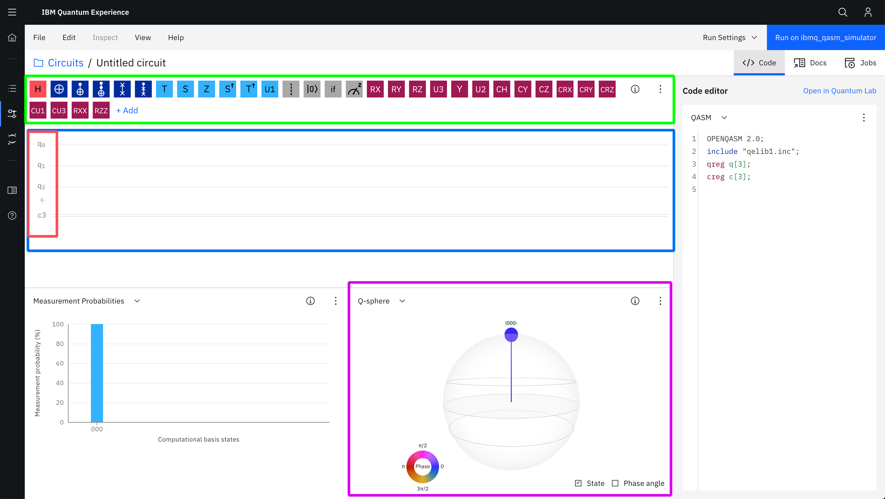
_Image of the IBM Q Experience dashboard circuit comopser highlighting the different areas of interest for this workshop_

The **GREEN** section is where we can find all of our gates and operations. It's from here that we can select a gate and drag it on to the **BLUE** section to apply the operation to a qubit.

The **BLUE** section is where we compose our quantum circuit. By placing gates and operations in sequence from left to right we can determine how our qubits will be affected.

The **RED** sections is a representation of our qubits. In this case our system currently has use of 3 qubits (labelled q0 through q2). By placing gates and operations on the line to the right of each qubit, we can perform that operation on the qubit. Think of it like writing a musical score on a piece of paper, except instead of writing notes to create music, we're manipulating the properties of our qubit for science (and fun!)

The **PURPLE** section shows the possible final states of our qubits based on our current circuit. Right now, there's nothing in our circuit to affect the state of our qubits, so there's a 100 percent chance that when measured a single qubit it will have a state of `|0>`.

### Placing our first gate

Right now, our quantum circuit has the use of 3 qubits, but in order to flip a coin, we only need one.

Hover over the qubits labelled q1 and q2 and a red trash can icon should appear (highlighted below by an orange box). Click it to remove them from application. We'll add them back in again later, but this will keep things simpler for now.

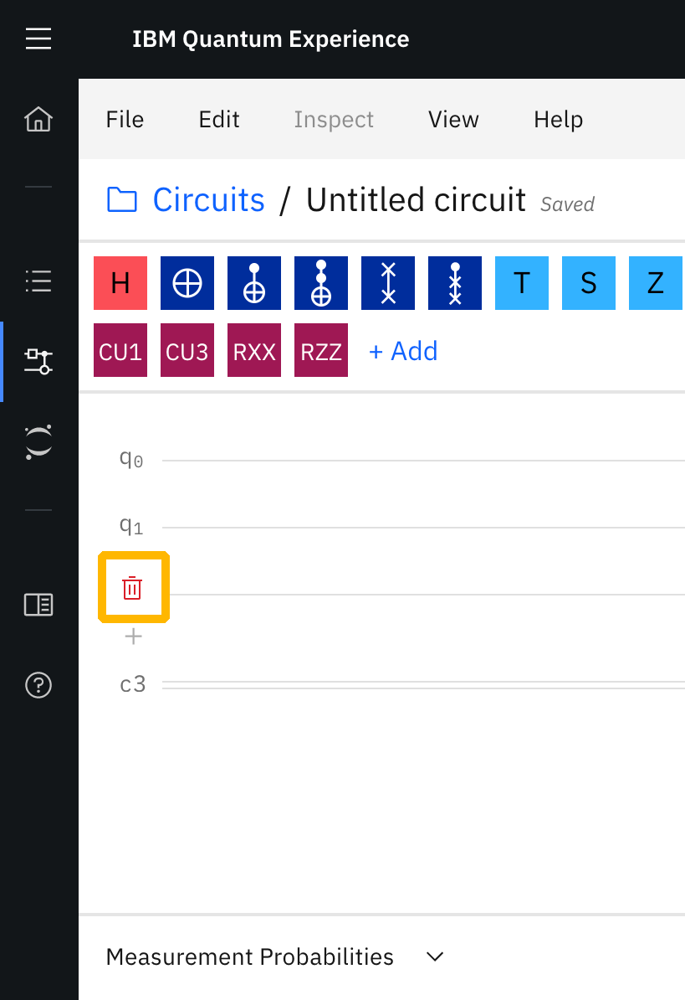
_Image of the IBM Q Experience dashboard circuit comopser highlighting the different areas of interest for this workshop_

At the top of our view, we have an array of gates and operations we can apply to our qubits. We're going to add a Hadamard gate to our remaining qubit. This put our qubit into a state of _superposition_ when the qubit when measured has an equal probability of collapsing to either a `|0>` or a `|1>`.

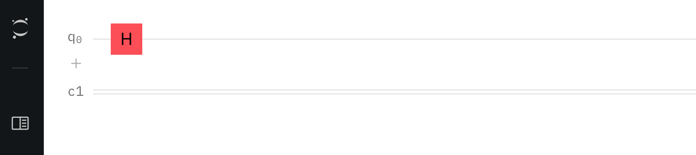
_Image the placement of a Hadamard gate on a qubit in a quantum circuit_

With our qubit in a state of superposition we have a perfectly random chance of our qubit being either a `|0>` or a `|1>` when measured - just like tossing a coin! In order to find out which it's going to be, we need to measure it's state.

At this point, our qubit is essentialy both a 1 and 0 and every possible state in between. When a qubit is measured it "collapses" (that is, it's forced to be either `|0>` or `|1>` ) which gives us our answer - heads or tails! When we take a measurement of our qubit, it will instantly become either of those states. A measurement is an irreversible action, once observed, we can not reverse that action to put the qubit back into the state it was before it was observed. We'd need to perform the same actions we undertook to put it into that state in the first place in order to achieve the same result.

Fun Fact:

Gates (such as the Hadamard or 'X' gate) are _always_ reversible. If we take the X gate, for example (the one which is analogous with a bit wise NOT operation in classical computing) and applied it to a qubit with a state of `|0>` it's state would become `|1>` - however, if we apply the 'X' gate again, it would again become `|0>`.

### Measuring our qubit's state
#### Taking a measurement

So, now that we've used a Hadamard gate to put our qubit into a superposition, we need to measure that qubit to see if it's going to be either `|0>` or `|0>`. 

In our array of gates and operations we're going to drag the "measure" operation (highlighted below in red) next to our Hadamard gate (highlighted in green).

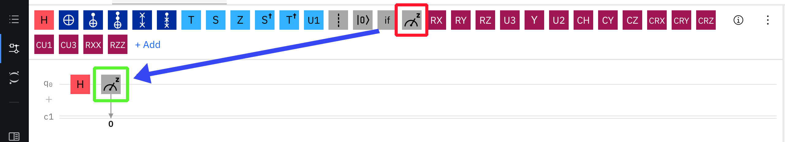
_Image showing the placement of a measurement operation on a qubit in a quantum circuit_

And that's it! We've built our first quantum circuit! When we run our program we will have either a `|0>` or `|1>` value (which we can treat much as a bit exactly as we would in a classical system).

#### Running our experiment

So, let's run our quantum program. 

Before we start sending off our programs to be run on an actual quantum computer, we're first going to use a simulator to check that it runs as we might expect and save our credits (the IBM Q Experience is free to use, but has a daily limit of the number of experiments we can run, so let's not use those up yet, we'll need them later).

In the top-right of the IBM Q Experience, you'll see a tab that reads "Run Settings" (highighted below in purple). Click on it and you'll see a new sub-navigation menu appear with some options on where we can run our program.

Click the dropdown "Backend" (highlighted in yellow) and select `32q imbq_qasm_simulator (noisy)` as the backend for our experiment.

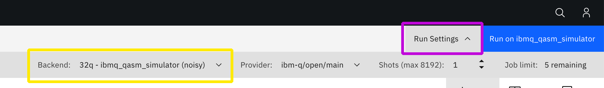
_Image showing how to set the backend for our experiment_

Once we've done that, we're good to go!

Click the blue "Run on imbq_qasm_simulator" button at the top-right of the page, then click the "Jobs" tab (highlighted in purple in the below image). You'll then see a list of all of your pending and complete jobs (highlighted in green). Click on the job to see our results.

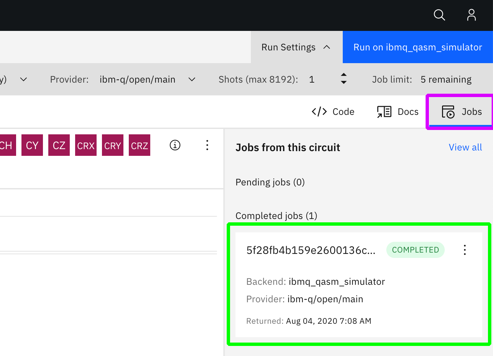
_Image showing how to run our experiment_

And you should see something like this:

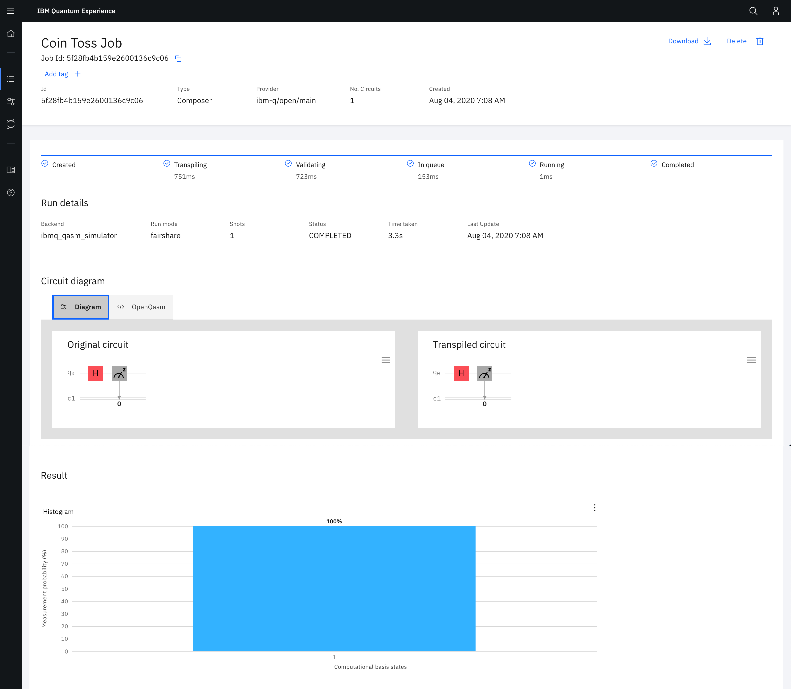
_Image showing our experiment results_

At the top we have information about how long it took our experiment to compile/run etc and at the bottom we have our results! As you can see when measured our qubit had a state of 1! So if 0 was tails and 1 was heads, this quantum coin flip would have yielded heads. Your result may be 1, or it may be 0 - there's no way for me to tell because I wrote this workshop before you ran your experiment!.

## Rolling a dice

Now that we've learned how to use a single qubit, let's use a couple more. Heads or tails is neat, but what if you wanted to play something like Snakes and Ladders? We'd need a few more possible results than "heads" or "tails".

When we opened our results for our last experiment a new tab was opened. Find the tab that contains our experiment and open it back up again.

We're going to simulate a dice roll. The minimum number of bits of information that we need to generate the binary value of 6 in base-2 maths is 3 (we can generate a number up to 7 from 0, so we have 8 possible values with 3 bits of information).

Just below q0 on our circuit composer you'll see a little `+` icon (highighted in green below).


_Image showing how to add a qubit to our circuit_

Click the `+` button twice to add two more qubits to our circuit.

Just the same as we did for our first qubit, we're going to add a Hadamard gate and a measure operation to put our qubits into a superposition state where the possibility of the outcome being 50% for either `|0>` or `|1>`.

Once you've placed your Hadamard gates and measure operation on the circuit composer you should have something like the following:

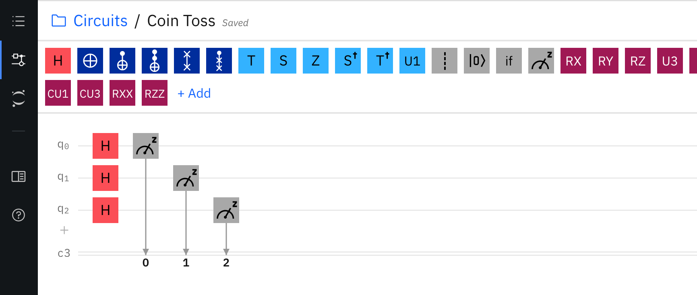
_Image showing our quantum circuit using 3 qubits being put into a superposition with Hadamard gates_

If you take a moment to look at the bottom-left corner of the IBM Q experience, you'll see a bar chart displaying the probabilities of the possible ouptput of our circuit displayed. As we said before, with 3 bits of information there are 8 possible values we can generate with base 2 math. Because we put each of our qubits into a superposition with an equal possibility of becoming either `|0>` or `|1>` each possible value between 0 and 7 has an equal probability of being the result as every other value - so each possible outcome has a (100 / 8)% chance of being the generated value - or 12.5% as the graph says.

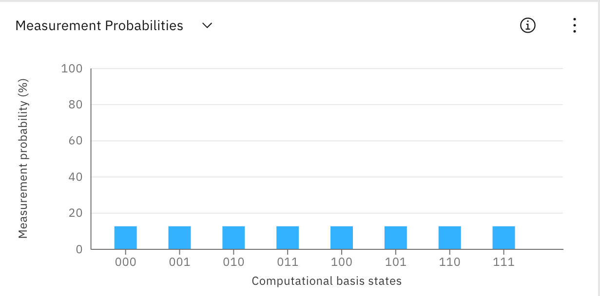
_Image showing the probabilities of the possible outcomes of our quantum circuit_

Hit the run experiment button up in the top-right again and then click to see the result of your latest experiment.


_Image showing the result of my experiment yielding the binary value for 2 in base 10 math_

As you can see, I got a 2!

## Generating the most random number you'll ever generate

We've had fun so far (well, at least I hope we have 😅). We've learned how to manipulate and measure the state of a 1 or more qubits towards a practical end, but everything we've done so far has been run in a simulator - now it's time to play with the real thing - let's spin up a circuit on a real-life quantum computer.

### Obtaining an API key.
#### (This step is optional, but useful if you plan to use Qiskit with an IBM Q outside of the IBM Q Experience. Skip to "Starting a Quantum Lab Notebook" if you don't want to do this)

The first thing we'll need to do is generate an API key that will allow and program we run to communicate with the IBM Q network.

At the top right of your page click the little user icon (highlighted below in red) and then select my account. This will take you to you account management page.

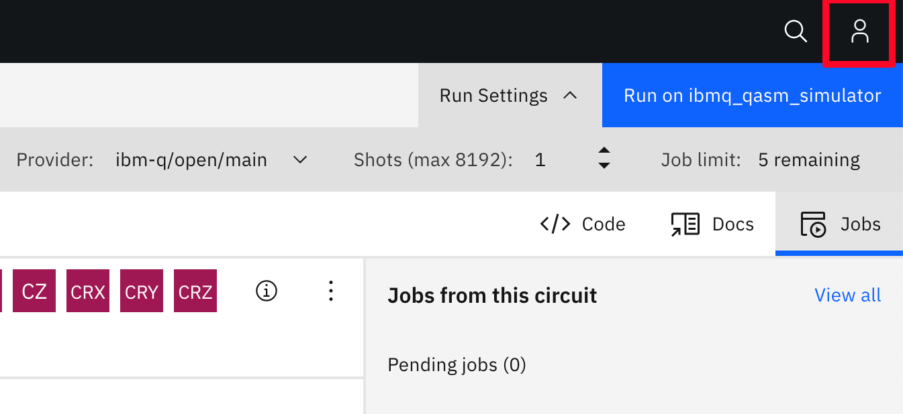
_Image showing the location of the user account button_

Direct your attention on the dashboard to the section highlighted blue in the image blue. This is where we can obtain an API key for usage in a few minutes. Click the button highlighted in red to copy your API key to your clipboard and save it somewhere for usage in a short while.

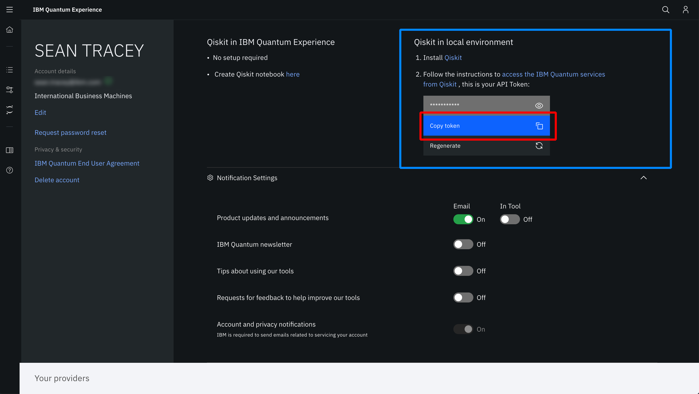
_Image showing where to obtain an IBM Q API key_

### Starting a Quantum Lab Notebook

Next, head on over the the left hand side of the screen and click the "Quantum Lab" button highlighted in red.

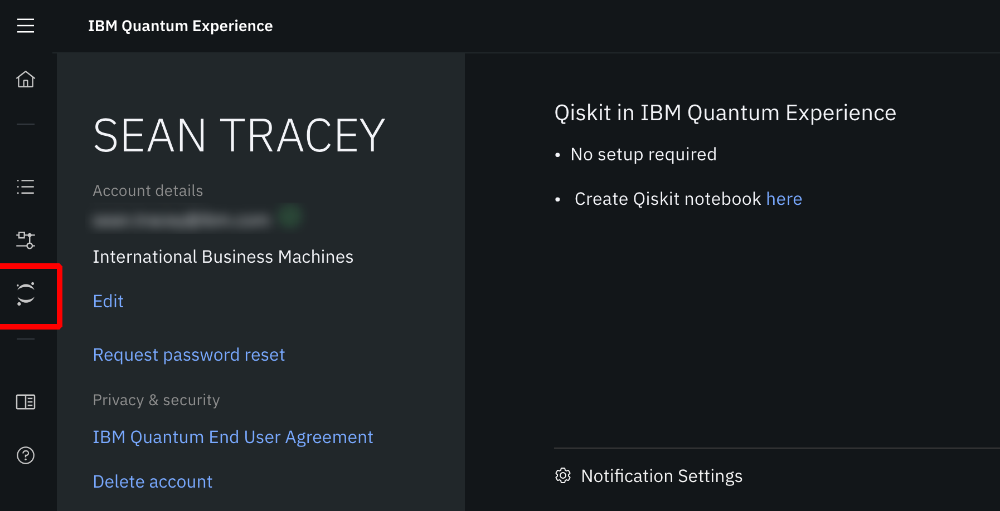
_Image showing how to open the Quantum Lab notebooks_

This will take you to the "Quantum Lab" section of the IBM Q Experience. Up until now we've been enjoying using the graphical circuit composer to construct our quantum circuits, but this time we're going to use a tiny bit of Python with [Qiskit](https://qiskit.org/) (an open-source SDK for programming any compatible Quantum computer) to make something as little more useful

Here, we have a fully functional Jupyter Notebooks equiped to program the IBM Q from the word go.

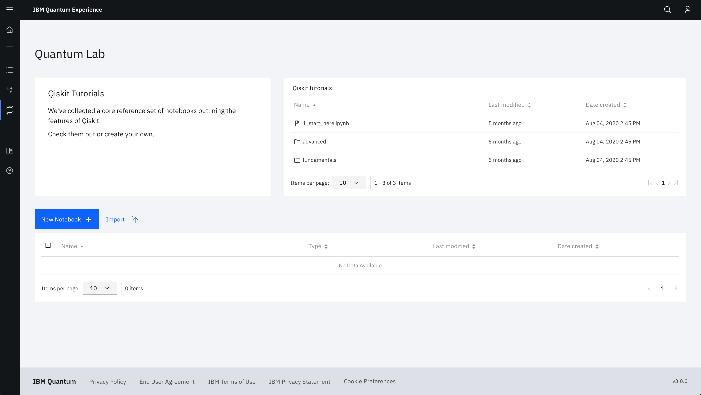
_Image showing the IBM Q Quantum Labs start page_

Click the "New Notebook" button to start a new notebook.

After a few seconds of starting up, you should see something like this:

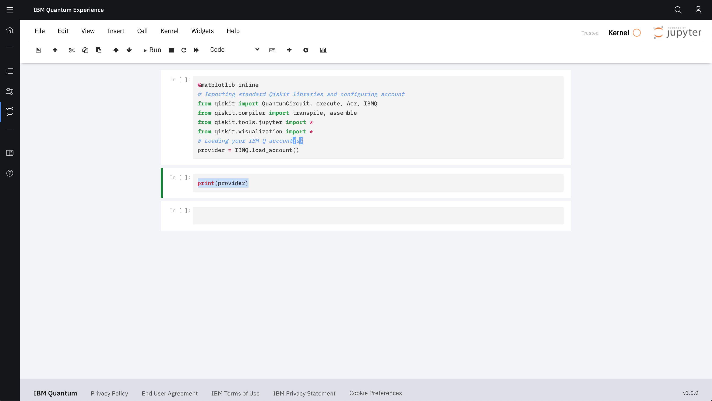
_Image showing the IBM Q Quantum Labs start page_

This notebook very helpfully pre-includes most of the pre-requisites we'd need for running most any kind of quantum circuit we can think of.

The first thing we're going to do is add one extra import to our notebook that will let us monitor the progress of our experiment as it's added to the IBM Q system.

Copy the below line and add it to the line just before `provider = IBMQ.load_account()` in your notebook

```python
from qiskit.tools.monitor import job_monitor
```

Once you've done that select the cell you've just added the line of code to and click the "Run" button at the top of the UI (highlighted in blue below)


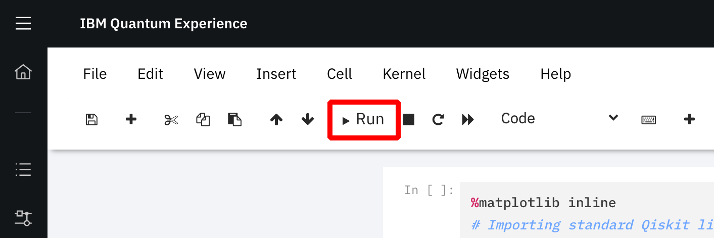
_Image showing the location of the "Run" button_

This will execute the code in the cell and import all of the dependencies in our application.

### Selecting a machine

Next up, we're going to check which quantum computers on the IBM Q network are available to use.

Copy and paste the following into the blank cell just below the cell containing our import statements and then click the run button again.

```python
    machines = IBMQ.get_provider(group='open')
    print(machines.backends())
```

After a few seconds, you should see an output not unlike the one below:

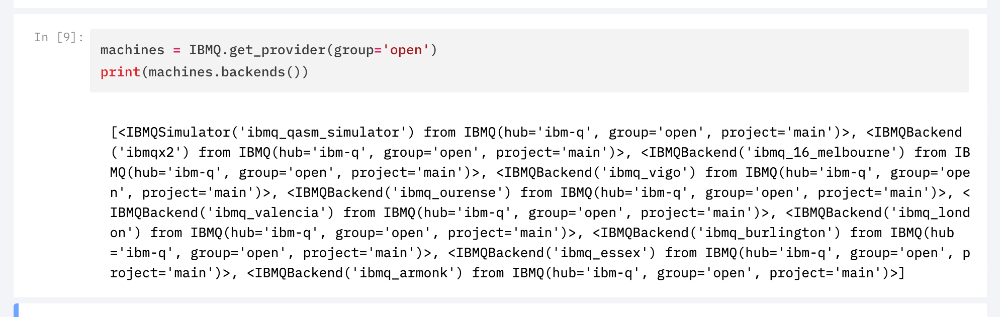
_Image showing the available systems on the IBM Q network_

These are all of the systems available for us to use.

The bit we're interested in is the names of the systems. We can use these to directly access the machines and run our quantum circuit on them. For example, let's look at the output for the IBM Q in Melbourne:

```
<IBMQBackend('ibmq_16_melbourne') from IBMQ(hub='ibm-q', group='open', project='main')>
```

If we copy the value at the start of the string (the name of the system) we'd have `ibmq_16_melbourne`, we can use that in our next bit of code.

Pick an IBM Q system at random, though there are difference between then (number of qubits, noise in the environment etc) they should all be adequate for our use case, and then copy and paste the the following in the cell after our last print statement (supplementing the placeholder for the name of the IBM Q system you've elected to use)..

```python
backend = machines.backends.<NAME OF SYSTEM YOU WISH TO USE>
```

I'm going to stick with the IBM Q in Melbourne because there's something cool about running a program on a quantum computer on the opposite end of the planet from me.

### Building our Quantum Circuit

Let's create a new cell to start building our quantum circuit in. With the previous cell we were working with still selected, go to the menu at the top of the view and select Insert -> Insert Cell Below. This will create a new cell for us to work in.

Next, copy and paste the following into our shiny new cell.

```python
QUBIT_NUMBER = 8

qc = QuantumCircuit(QUBIT_NUMBER)

for i in range(0, QUBIT_NUMBER):
    qc.h(i)

qc.measure_all()
```

On the first line, we're creating a variable `QUBIT_NUMBER` for how many qubits we want to use for our application. Although some of the quantum systems will have many more qubits than the 8 we want to use, we're only going to generate an 8-bit number (a number somewhere between 0 and 254), so we only need 8 bits of information.

After that, we create a variable `qc` which becomes a reference for building our quantum circuit using qiskit. We pass the variable `QUBIT_NUMBER` into the `QuantumCircuit` method that was already imported for us right back at the very start of the notebook. This tells Qiskit how many qubit we want to use in our quantum circuit.

Next, we have a small for look which adds a Hadamard gate to each of our qubits to put them in a state of superposition - just as we did in the visual circuit composer, except this time we're doing it with Python 🎉

Finally, we have `qc.measure_all()` which is a convenience function which will measure the state of all of the qubits in our circuit.

Click the run button again to load this code into our program, it's almost time to run our circuit on an actual quantum computer!

### Running our experiment

That's our circuit constructed, wasn't too much work in the end, was it? 🥳

Let's add another cell below our previous one and then add the following to it:

```python
job_exp = execute(qc, backend=backend, shots=1)
job_monitor(job_exp)

result_exp = job_exp.result()
counts_exp = result_exp.get_counts(qc)

generated_binary_number = int(list(counts_exp.keys())[0], 2)

print('Our randomly generated number is:', generated_binary_number)
```

The first two lines execute and then monitor the execution of our quantum circuit on the quantum system. There's a limited amount of quantum computing resource on the public network, so you're job will be added to a queue for execution. `job_monitor` will track the job and then report when it's finished and we're ready to get the results.

Once the job has finished executinfg we load the result into the variable `result_exp` with `job_exp.result()`. This gets all of the data from our circuits execution and lets us view it. What we're interested in is the "counts" which is just a collection of the results of the multiple executions of our circuits. There'll only be 1 count in this instance as we only run a single "shot" of our circuit on the system (more on that in the video above). We get the "counts" of our experiment with `result_exp.get_counts(qc)` which returns a dictionary of the states of our qubits and the number of times the experiment yielded each result. If we were to inspect to `counts_exp` variable we'd see something like `{'00000001' : 1}` which would tell us we had 7 qubits measured as `|0>` and one as `|1>`.

On the final two lines, we convert those counts to a base 10 number - our number generated from the execution of our quantum circuit - totally random thanks to the nature of the qubit - and finally we print it out to the system.

Click on the run button one last time, and you should see something like this:


_Image showing the successful execution of our circuit on an IBM Q system_

Congratulations! You just ran your very first quantum computing circuit!