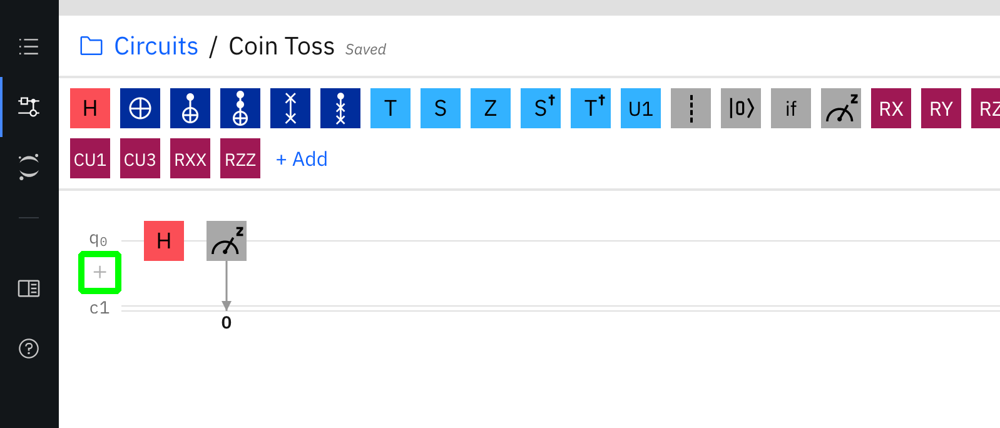

# Hands-on-with-Quantum-Computing
We live in the future 🤯

## About this workshop

This workshop is intended as a "Hello, world" for programming quantum computers.

On completion of this workshop you will have learned:

1. The basics of manipulating a Qubit in a quantum system
2. What a Hadamart gate is 
3. How to construct a quantum circuit using the [IBM Q Experience](https://quantum-computing.ibm.com/).
4. How to implement that same quantum circuit with [Qiskit](https://qiskit.org/)

With the above knowledge, we will learn how to:

1. Simulate a coin flip with a quantum computer
2. Simulate the roll of a dice with a quantum computer
3. Generate a random 8 bit number with an IBM Q

If you are a developer with little to no experience of quantum computing you will finish this workshop with a practical demonstration of the ease of which a quantum computer can be utilised through a cloud environment

If you're a quantum physicist, you will have learned the same, but you will also have been equipped with tools which you can use to run quantum experiments on an actual quantum system.

## You will need:

1. Your favourite IDE
2. An IBM account to sign in to the IBM Q Experience dashboard
    - You can also sign in with the following accounts:
        - Twitter Account
        - Google Account
        - LinkedIn Account
        - GitHub Account
3. A modern web browser
4. (Optionally) An [IBM Cloud account](https://ibm.biz/Bdq8Ly)

## Getting started

For the first part of this workshop, we're going to use the [IBM Q Experience](https://quantum-computing.ibm.com/) dashboard to create our quantum circuits.

The IBM Q Experience dashboard is a visual tool which allows us to create and execute a quantum circuit by arranging gates and connections for a number of Qubits in a quantum system.

First up, head to [https://quantum-computing.ibm.com/](https://quantum-computing.ibm.com/) and login with an account of your choice.

_A screenshot of the IBM Q Experience login page_

Once you've logged in, you'll be taken to your dashboard. On the left hand side of the screen, you should see a small toolbar of icons. Click the "Circuit Composer" icon (highlighted in green in the image below)

_Image of the IBM Q Experience dashboard highlighting the circuit comopser icon_

## Flipping a coin

Once the page has loaded, you should now see the Circuit Composer page. Here, we can drag [quantum gates](https://en.wikipedia.org/wiki/Quantum_logic_gate) onto our quantum circuit to manipulate and measure the state of our qubit.

A "gate" is what we call an operation that can be performed on a qubit. They can be used to put a qubit in to a state of superposition, flip its state, rotate its position around an axis, adjust it's phase and more.

The combination of these gates can be used to create operations that are analogous with operations in classical computing. For example, the application of a X gate to qubit will flip its state between "0" ( `|0>` ) and "1" ( `|1>` ). This operation is equivalent to a "not" gate in classical computing.

The gate we're going to be focussing on exclusively in this workshop is perhaps the most commonly used gate - [The Hadamard Gate](https://en.wikipedia.org/wiki/Quantum_logic_gate#Hadamard_(H)_gate) or "H gate" to its friends.

Let's take a moment to get to grips with the different features of the UI.

_Image of the IBM Q Experience dashboard circuit comopser highlighting the different areas of interest for this workshop_

The **GREEN** section is where we can find all of our gates and operations. It's from here that we can select a gate and drag it on to the **BLUE** section to apply the operation to a qubit.

The **BLUE** section is where we compose our quantum circuit. By placing gates and operations in sequence from left to right we can determine how our qubits will be affected.

The **RED** sections is a representation of our qubits. In this case our system currently has use of 3 qubits (labelled q0 through q2). By placing gates and operations on the line to the right of each qubit, we can perform that operation on the qubit. Think of it like writing a musical score on a piece of paper, except instead of writing notes to create music, we're manipulating the properties of our qubit for science (and fun!)

The **PURPLE** section shows the possible final states of our qubits based on our current circuit. Right now, there's nothing in our circuit to affect the state of our qubits, so there's a 100 percent chance that when measured a single qubit it will have a state of `|0>`.

### Placing our first gate

Right now, our quantum circuit has the use of 3 qubits, but in order to flip a coin, we only need one.

Hover over the qubits labelled q1 and q2 and a red trash can icon should appear (highlighted below by an orange box). Click it to remove them from application. We'll add them back in again later, but this will keep things simpler for now.

_Image of the IBM Q Experience dashboard circuit comopser highlighting the different areas of interest for this workshop_

At the top of our view, we have an array of gates and operations we can apply to our qubits. We're going to add a Hadamard gate to our remaining qubit. This put our qubit into a state of _superposition_ when the qubit when measured has an equal probability of collapsing to either a `|0>` or a `|1>`.

_Image the placement of a Hadamard gate on a qubit in a quantum circuit_

With our qubit in a state of superposition we have a perfectly random chance of our qubit being either a `|0>` or a `|1>` when measured - just like tossing a coin! In order to find out which it's going to be, we need to measure it's state.

At this point, our qubit is essentialy both a 1 and 0 and every possible state in between. When a qubit is measured it "collapses" (that is, it's forced to be either `|0>` or `|1>` ) which gives us our answer - heads or tails! When we take a measurement of our qubit, it will instantly become either of those states. A measurement is an irreversible action, once observed, we can not reverse that action to put the qubit back into the state it was before it was observed. We'd need to perform the same actions we undertook to put it into that state in the first place in order to achieve the same result.

Fun Fact:

Gates (such as the Hadamard or 'X' gate) are _always_ reversible. If we take the X gate, for example (the one which is analogous with a bit wise NOT operation in classical computing) and applied it to a qubit with a state of `|0>` it's state would become `|1>` - however, if we apply the 'X' gate again, it would again become `|0>`.

### Measuring our qubit's state
#### Taking a measurement

So, now that we've used a Hadamard gate to put our qubit into a superposition, we need to measure that qubit to see if it's going to be either `|0>` or `|0>`. 

In our array of gates and operations we're going to drag the "measure" operation (highlighted below in red) next to our Hadamard gate (highlighted in green).

_Image showing the placement of a measurement operation on a qubit in a quantum circuit_

And that's it! We've built our first quantum circuit! When we run our program we will have either a `|0>` or `|1>` value (which we can treat much as a bit exactly as we would in a classical system).

#### Running our experiment

So, let's run our quantum program. 

Before we start sending off our programs to be run on an actual quantum computer, we're first going to use a simulator to check that it runs as we might expect and save our credits (the IBM Q Experience is free to use, but has a daily limit of the number of experiments we can run, so let's not use those up yet, we'll need them later).

In the top-right of the IBM Q Experience, you'll see a tab that reads "Run Settings" (highighted below in purple). Click on it and you'll see a new sub-navigation menu appear with some options on where we can run our program.

Click the dropdown "Backend" (highlighted in yellow) and select `32q imbq_qasm_simulator (noisy)` as the backend for our experiment.

_Image showing how to set the backend for our experiment_

Once we've done that, we're good to go!

Click the blue "Run on imbq_qasm_simulator" button at the top-right of the page, then click the "Jobs" tab (highlighted in purple in the below image). You'll then see a list of all of your pending and complete jobs (highlighted in green). Click on the job to see our results.

_Image showing how to run our experiment_

And you should see something like this:

_Image showing our experiment results_

At the top we have information about how long it took our experiment to compile/run etc and at the bottom we have our results! As you can see when measured our qubit had a state of 1! So if 0 was tails and 1 was heads, this quantum coin flip would have yielded heads. Your result may be 1, or it may be 0 - there's no way for me to tell because I wrote this workshop before you ran your experiment!.

## Rolling a dice

Now that we've learned how to use a single qubit, let's use a couple more. Heads or tails is neat, but what if you wanted to play something like Snakes and Ladders? We'd need a few more possible results than "heads" or "tails".

When we opened our results for our last experiment a new tab was opened. Find the tab that contains our experiment and open it back up again.

We're going to simulate a dice roll. The minimum number of bits of information that we need to generate the binary value of 6 in base-2 maths is 3 (we can generate a number up to 7 from 0, so we have 8 possible values with 3 bits of information).

Just below q0 on our circuit composer you'll see a little `+` icon (highighted in green below).

_Image showing how to add a qubit to our circuit_

Click the `+` button twice to add two more qubits to our circuit.